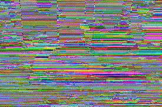

# Birte sin brilliante biletebeskyttelse

Av: Sverre Johann Bjørke

Birte ynskjer seg kun éin ting til jul, og ynskjelista hennar er difor eit bilete av tingen. Birte er bevisst på tryggleik på nett og har forsøkt å obfuskere biletet slik at ingen andre enn julenissen skal kunne lese det. Diverre er ikkje julenissen i stand til å tyde biletet. Kan du hjelpe? Svaret vi skal fram til er altså gjenstanden i biletet. (Løysningsordet er på bokmål)

PNG-biletet her består av ein matrise av pikslar. Kvar piksel består igjen av ei liste med tre fargeverdier (rgb). Eksempel på ein piksel kan vere [0, 255, 0], ein grøn piksel.

Kvar piksel (med unntak av den første) i det obfuskerte biletet har verdien ein får av å XORe tilsvarande piksel i det originale biletet med foregåande piksel (denne då frå det obfuskerte biletet). Dette blei gjort i “vanleg” rekkefølge venstre mot høgre, ovenfrå og ned.

Teknikken XOR-ar parvis dei korresponderande fargeverdiane i pikslane.
For pikslane A = [130, 105, 49] og B = [22, 168, 25] blir då A XOR B [148, 193, 40]

Vi forklarar litt, i tilfelle du er ukjend med XOR:

XOR er ein bitvis operasjon. Om to bits er like blir verdien 0, om to bits er ulike blir verdien 1.

* 7 binært = 111
* 3 binært = 011
* Vi ser at det er kun første bit som er ulik. Første bit i resultatet blir da 1, resten 0.
* 7 XOR 3 = 100 = 4

## Eksempel

Eit bilete på 1 x 5 pixlar
`[[240, 33, 11], [205, 111, 102], [120, 96, 7], [45, 3, 202], [76, 237, 47]]`

vil bli obfuskert til

`[[240, 33, 11], [61, 78, 109], [69, 46, 106], [104, 45, 160], [36, 192, 143]]`