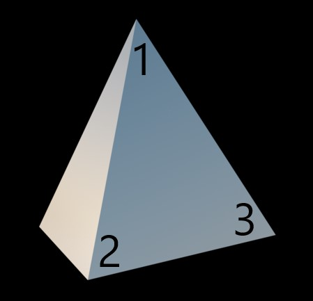

# 3D-pynt

Av: Imre Kerr

Anders har kjøpt seg 3D-printer, og er i gang med å printe julepynt. Han vil gjerne vite hvor mye materiale som går med på hvert stykke pynt. Printeren er av typen som bruker flytende resin, så han vil ha svaret i milliliter.

## Oppgave
Fila [model.csv (zippet)](./model.csv.zip) inneholder en 3d-modell som skal printes, i følgende format:

Modellen er bygd opp av trekanter. Hver linje inneholder ni tall som til sammen beskriver én trekant. De tre første tallene er x-, y- og z-koordinaten (i millimeter) til det første hjørnet, de tre neste det neste hjørnet, og de tre siste det siste hjørnet.

Rekkefølgen til hjørnene følger høyrehåndsregelen. Det vil si at hvis rekkefølgen går mot klokka fra ditt ståsted, peker den flaten av trekanten som er på utsiden av modellen mot deg:


Illustrasjon av høyrehåndsregelen
Hvor mange milliliter plast bruker han per stykke pynt?

Gi svaret med tre desimaler.

## Eksempel

```
0,0,0,10,0,0,0,0,10
0,0,0,0,0,10,0,10,0
0,0,0,0,10,0,10,0,0
10,0,0,0,10,0,0,0,10
```

Svar: 0.167

## Løsning

Svar: 7.302

Diskusjonstråd: https://gist.github.com/knowitkodekalender/87d1b4e06be8038f00f263b0604d056f