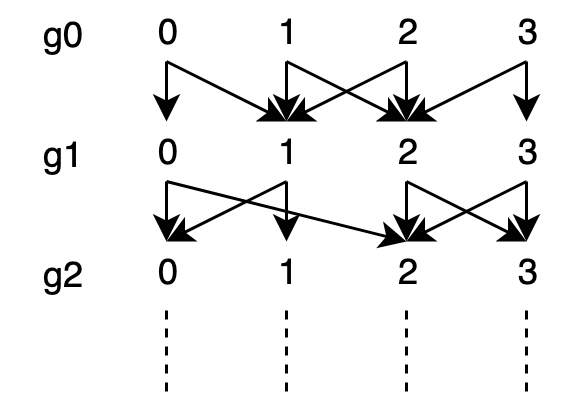

# Nissens nye superalver

Av: Hugo Wallenburg

Julenissen er misfornøyd med sine nåværende alver. De jobber stadig saktere, krever mer lønn og rettigheter og drikker stadig dyrere kaffe. Den siste utviklingen ifølge Nordpolens Gang er at alver nå oppretter fagorganisasjoner! Nissen begynner å frykte for bunnlinja og pønsker ut en plan for å sikre seg Nordpolens produksjonsmidler.

Han henter de glupeste alvene sine og setter dem i arbeid med å lage en ny type alv: En alv som er sterkere, raskere og smartere, og som har full og ekslusiv lojalitet til Julenissen. En replikalv. En superalv!

Nissens nye superalver legger egg hver kveld og dør innen midnatt. Morgenen etter klekker samtlige egg og en ny generasjon alver er klare for dagens utfordringer. Slik mener Nissens glupske forskeralver at superalvene aldri klarer å organisere seg. Nissen har eksperimentert med de nye alvene sine i en måned, men nå har de sannelig opprettet sin første fagorganisasjon! Dette må stoppes en gang for alle!

Forskeralvene mener organiseringen skyldes en genfeil og vil finne mulige kandidater hvor genfeilen først oppstod. Det blir din jobb, du din glupe alv!

[Denne filen (zippet)](./generations.txt.zip) inneholder alle generasjonene med superalver. Hver linje inneholder en semikolon-separert liste med alver som hver har to kommaseparerte verdier som er den alvens foreldre i forrige generasjon. Den øverste linjen er generasjon 0 (nåværende generasjon), og linjene nedover kan leses som n generasjoner siden.

## Eksempel:

```
0,1;1,2;1,2;2,3   # Nåværende generasjon (generasjon 0)
0,2;0,1;2,3;2,3   # 1 generasjon siden (generasjon 1)
...               # 2 generasjoner siden, etc...
```

Som diagram:



Her har den nåværende generasjonen (generasjon 0) henholdsvis foreldrene 0 og 1, 1 og 2, 1 og 2, 2 og 3 i forrige generasjon (generasjon 1).

Alv 2 fra generasjon 2 er den første alven som har spredd genene sine til alle alvene i nåværende generasjon. Denne alven er forelder til alvene 0 og 2 og 3 i generasjon 1 og disse er mellom seg foreldre til alle alvene i generasjon 0.

Alle oddetallsalvene i generasjon 0 har startet fagorganisasjon. Vi må vite mer om genet som forårsaker denne feilen! Hvem er den første alven som kan ha spredd genene sine til alle oddetallsalvene i generasjon 0? Dersom det er flere i samme generasjon, gi kun den lavest nummererte alven.

Gi svaret på form `<generasjonsnummer>:<alv>`. For eksempelet ville svare vært 2:2.